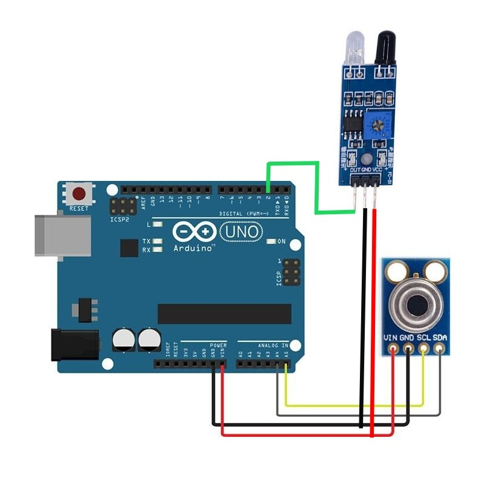
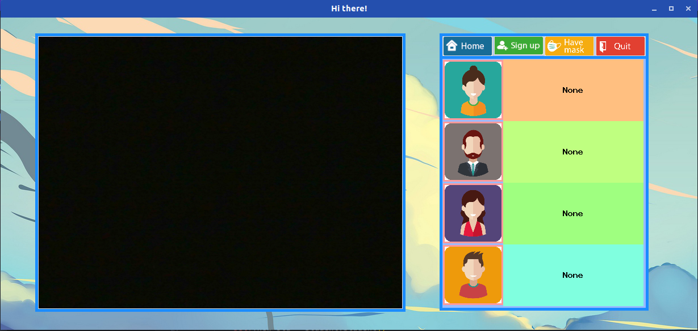
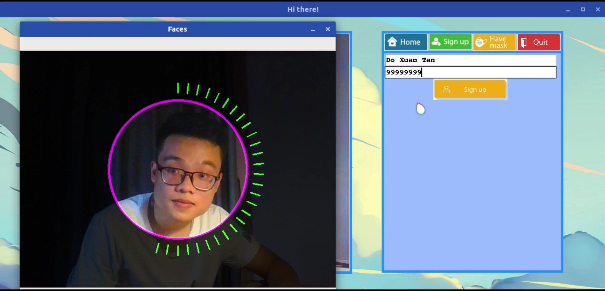
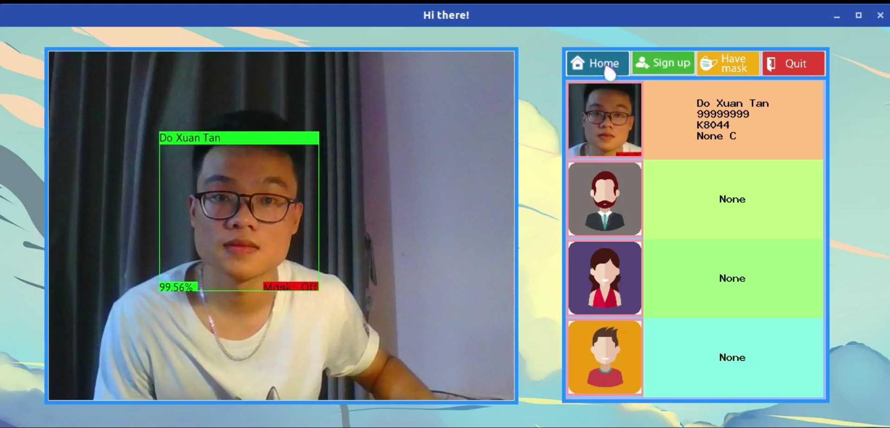
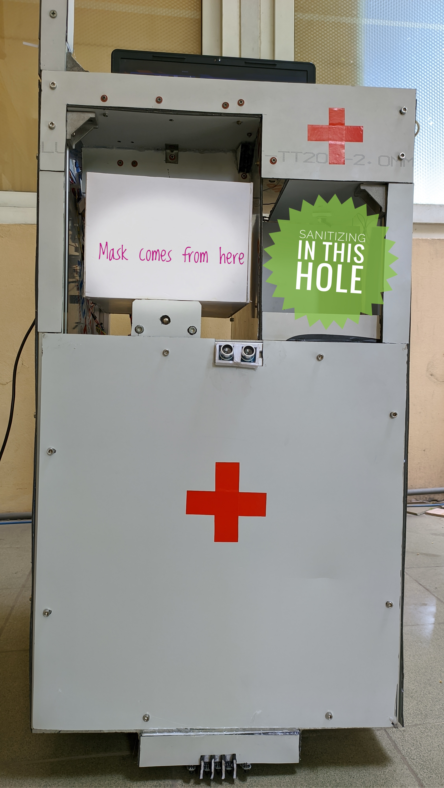
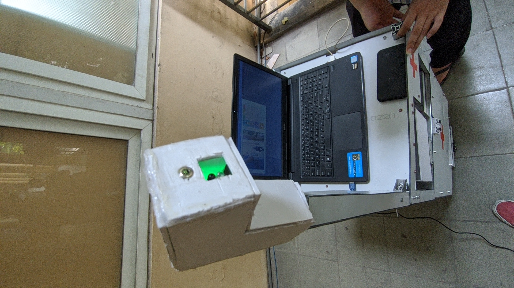
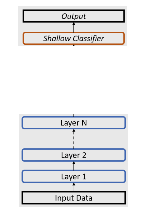
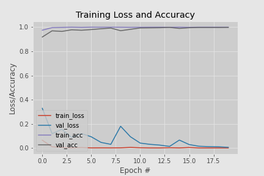

# Introduction
 This repo is a part of a medical robot that serves in hospital or clinic. The robot can check human temperature and give out (free) hand sanitizer and (free) mask if requested by comunicating with an external Adruino board.
 It can also regconize patients if they've signed up and check if there were a mask on thier face. This is done by using 2 models separately. 
 for the GUI, tkinter was used for its simplicity.
 
 ## How to use 
 - upload ``` mask.ino ``` file to an Arduino board
 - Stick it into your laptop
 - run ```GUI.py``` file and you're good to go   
 [Disclaimer]: Without an Arduino borad connected, the fps could be fluctuated as the programe will try to read temp from sensor repeatedly.  
 The programe is written to run in Linux.
 
 ## Prerequisites
 
 - tensorflow 2.x
 - keras 
 - dlib 19.x +
 - keras_vggface
 - glob
 - pickle
 - serial
 - and openCV of course
 - adruino
 - mlx90614 - infrared thermometer
 - a proximity sensor (any type of it, in this case, an ir sensor was used as it cost just nearly 0.5 buck

## Running the test
### On the Arduino
Connect sensors to arduino as the image below
  
If anything gets close to the proximity sensor, adruino will read the temp from mlx90614. As the signal from thermometer is analog, there would be no lag or delay. The signal wlll then be processed by ``` <Adafruit_MLX90614.h>``` library, what we receive is just a very fine processed temperature. However, each sensor will need to be added an offset value (ranging to 3.5 Celsius). In this case, the value is initually set by 1.4.  
Next step, upload ``` mask.ino ``` file to an Arduino board and plug it to computer
### On the computer
The GUI will have an apperance like this  
  
if this is the first time the computer've seen new user then spend a littie time to sign up. An window will pop up to collect user's images
 
wait a few seconds (actually it takes "some" few seconds to complete adding new user)  
  
Alright, from now on, robot should have a new friend :v.  
### how about face mask and hand sanitizer, you said it gives freely???
- For the face mask, press ``` Have mask``` button and a white box will slide to you.
- If you want to clean your hand, put it on the hole beside white box.
- However in the scope of this repo, how they works won't be included. 
  
Sorry, the robot looks a bit ugly, it lives on budget :(
- Don't foget to check your temp by moving your forehead to this little stick.

- Then, your information will be saved in ```data/xlsx/yyyy-mm-dd.xlsx```

# What are the models in this repo ???

This robot has 2 models on his brain. 1 is to recognize users, the other is to check if they are putting on a mask. Both of these two used Transfer Learning method
## Face recognition
With the Backbone is VGGFace2, this model gives an incredible result (with non-asian face). Without my face signed up, it confused me between strangers and Obama's First lady - Michelle Obama (?????). Can't bilieve we have any kind of these blood ties.
The thing is, this model is built for non-asian faces and it needs some change in its weight.
### Model architecture
Well, basically, it's just a VGGFace2 model without FC layers. See detail here: [VGGFace](https://www.researchgate.net/publication/318798243_Artificial_Intelligent_System_for_Automatic_Depression_Level_Analysis_through_Visual_and_Vocal_Expressions)  
However, the Robot need to update his knowledge whenever he gets a new friend. with a poor computing ability, he can not put the whole model to the RAM just to update the last layer, that would consume plenty of time and possibly, leave him no memory. So, the whole model would be splited into 2 parts: 
- Feature Extraction
- Classification
  
The feature extraction part will be init at first and shouldn't have any modifications. It locates in ```/models/feature_model.h5```  
The other one, also on the other hand, updates everytime a new user signs up. The feature of new user (output of feature extraction) will be computed one time    every user and saved in ```/data/pickle/features``` in format ```.pickle```. These features are the data to train classification.  
As i said, the weight should have a littile change to work with asian people.  
### Data for tuning
data comes from this link. All are VietNamese people.
[VietNamese data](https://viblo.asia/p/vn-celeb-du-lieu-khuon-mat-nguoi-noi-tieng-viet-nam-va-bai-toan-face-recognition-Az45bG9VKxY)  
only last 50 layers would be tuned as:
- the first layers doesn't have a significant impact on regconizing. Basically, it's just general features.
- the maximum RAM on Google Colab i could get is 25GB, over 50 layers, overflow memory.

### Data for recognition
Well, Robot has his new friends everyday, he gets new data everytime he gets a new friend.

## Face_mask model
### Model architecture
This model bases on MobileNetV2, and again, top_include=False.  
The last few layers contain:
- Dense (128)
- Dropout (0.5)
- Dense (2)  
The result returns quite good at 93% on test set

### Data
Thanks to [Mì Ai](https://www.miai.vn/thu-vien-mi-ai/), i found this dataset in the last days of this project.
The dataset contains all of "with_mask" images, and not so clean. So, i filtered it a bit.  
The "without_mask" data comes from LWF dataset. Only need to take an equal number of images and we're good to go.  
New dataset can be download in [here](https://drive.google.com/drive/folders/1Kyju0sJ5jR9wdRYQTGI1nXdRhpr_FJUS?usp=sharing).


